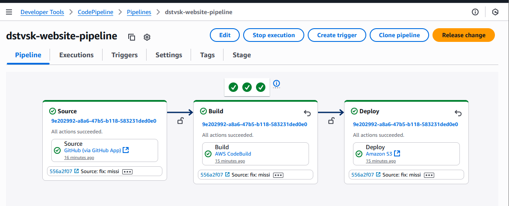
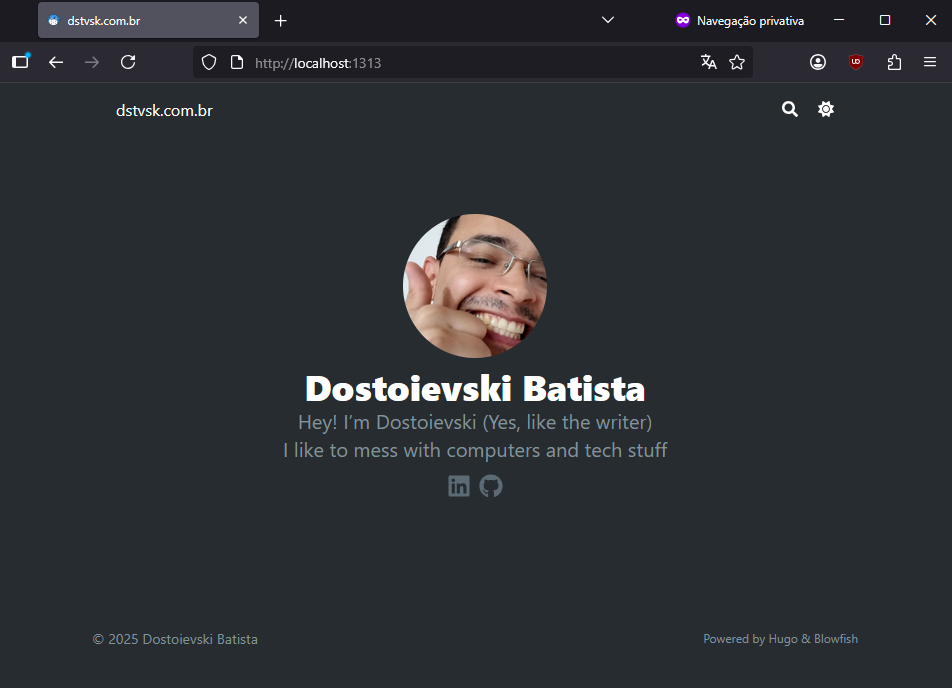
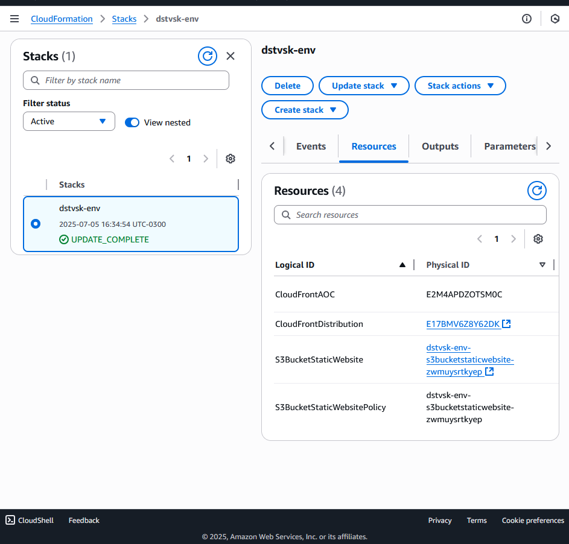

# ☁️ dstvsk.com.br
### What is this repository?
In this repository you will find everything that makes my personal blog, dstvsk.com.br, from the CloudFormation template to the Hugo project setup.
- folder `src`: Hugo setup using blowfish theme.
- folder `templates`: Holds the AWS CloudFormation templates that creates the stacks in my AWS account.
- file `buildspec.yml`: CodeBuild configuration.
- folder `src/content`: Where I will add the actual content of the blog.

### Pipeline
I have setup simple pipeline here: Everytime we submit a commit to the main branch, AWS CodePipeline will:
- Pull the code from Github
- Generate the static files using hugo
- Update the S3 bucket with the new content

You can check the `buildspec.yml` file to see which commands are running in CodeBuild.


### Running the Hugo project locally
- First we move to the folder `cd src`
- Verify if we have hugo installed typing `hugo version` in CLI, if we don't we can install it using `sudo apt install hugo` if you are using Debian distro.
- Then we just run `hugo server` and we should be able to access it https://localhost:1313:


### Infrastructure
I'm using CloudFormation to provision the infra inside AWS. You can check the templates used in the `templates` folder, I tried to comment everything there.
For now I'm using the cli to create the stacks because I don't see any change to the infra in the future.
```bash
# Check if the CLI client is connected
aws sts get-caller-identity
# Create stack
aws cloudformation create-stack --stack-name dstvsk-env --template-body file://./templates/dstvsk-env.yml
# Update stack
aws cloudformation update-stack --stack-name dstvsk-env --template-body file://./templates/dstvsk-env.yml
```
Here is the stack created and updated:


### Improvements for the future
- Add the pipeline and Route53 configuration to CloudFormation